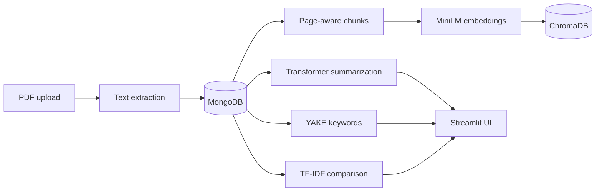

# PaperPal

[](https://github.com/zakilbaki/paperpal-rag-assistant/actions/workflows/ci.yml)

Scientific document intelligence application for uploading PDFs, generating concise
summaries, extracting keywords, and comparing papers through a web interface.

PaperPal combines a FastAPI service, Streamlit UI, MongoDB persistence, and a local
Transformer summarizer. The complete stack runs with one Docker Compose command.

> **Scope note:** the current application is document intelligence, not a complete RAG
> question-answering system. Retrieval-grounded chat is a roadmap item; the repository
> does not claim that capability before an evaluated retrieval pipeline exists.

The decisions and preliminary experiments guiding that roadmap are recorded in
[`docs/rag-architecture-decisions.md`](docs/rag-architecture-decisions.md).

## Product workflow



| Capability | Implementation |
| --- | --- |
| PDF ingestion | Validated upload, 3 MB limit, PyMuPDF extraction |
| Summarization | Lazy-loaded DistilBART, short/medium/detailed modes, Mongo cache |
| Keywords | YAKE extraction with configurable `top_k` |
| Comparison | Overall and section-level TF-IDF similarity, keyword overlap |
| RAG indexing | Experimental page-aware chunks in MongoDB and MiniLM vectors in ChromaDB |
| RAG retrieval | Experimental single-paper top-k passages with scores and citation metadata |
| Context building | Overlap-aware evidence packet with stable citations and a token budget |
| Persistence | Async MongoDB access through one shared client |
| Delivery | FastAPI, Streamlit, MongoDB, and Docker Compose |

## Run locally

Requirements: Docker and Docker Compose. No cloud database or secret is required for
the local stack.

```bash
docker compose up --build
```

Open:

- Streamlit UI: `http://localhost:8501`
- FastAPI docs: `http://localhost:8000/docs`
- Health endpoint: `http://localhost:8000/api/v1/health/`

MongoDB and ChromaDB data are stored in the named `mongo_data` and `chroma_data`
volumes. Models are downloaded lazily on the first operation that requires them.

To use MongoDB Atlas or another model, copy the environment template and override the
defaults:

```bash
cp .env.example .env
```

Never commit the resulting `.env` file.

## API example

Upload a paper:

```bash
curl -X POST http://localhost:8000/api/v1/papers/upload \
  -F 'file=@paper.pdf'
```

Generate a summary using the returned `paper_id`:

```bash
curl -X POST http://localhost:8000/api/v1/papers/summarize \
  -H 'Content-Type: application/json' \
  -d '{
    "paper_id": "<paper_id>",
    "summary_type": "medium",
    "use_cache": true
  }'
```

Create or replace the retrieval index for that paper:

```bash
curl -X POST http://localhost:8000/api/v1/papers/<paper_id>/rag/index
```

Retrieve cited passages from that paper:

```bash
curl -X POST http://localhost:8000/api/v1/papers/<paper_id>/rag/retrieve \
  -H 'Content-Type: application/json' \
  -d '{"question":"What method was used?","top_k":5}'
```

## Repository structure

```text
backend/
  app/api/          FastAPI routes
  app/core/         environment settings
  app/db/           shared async Mongo connection
  app/rag/          chunking, embeddings, retrieval, context building, Chroma adapter
  app/services/     parsing, summarization, keywords
  tests/            dependency-light unit tests
frontend/
  streamlit_app.py  user interface
docker-compose.yml  local app, MongoDB, and persistent Chroma storage
```

## Quality checks

The lightweight unit suite covers deterministic RAG chunking and the legacy PDF section
parser without downloading an ML model:

```bash
python -m pip install pytest fastapi httpx pydantic-settings pymongo certifi \
  python-multipart PyMuPDF yake numpy scikit-learn pdfminer.six psutil
PYTHONPATH=backend pytest -q backend/tests
```

GitHub Actions runs the tests and compiles all Python sources on each pull request.

## Current limitations

- The 3 MB upload limit is intentionally conservative for CPU-only hosting.
- Generated summaries still require human review; no factuality benchmark is claimed.
- Scanned PDFs require OCR, which is not included yet.
- Answer generation, relevance-threshold calibration, and broader retrieval evaluation
  remain roadmap items; the current endpoint returns ranked evidence only. Preliminary
  real-paper retrieval results are documented in the architecture decision record.
- A production deployment target is intentionally out of scope; the verified target is
  the local Docker Compose stack.
