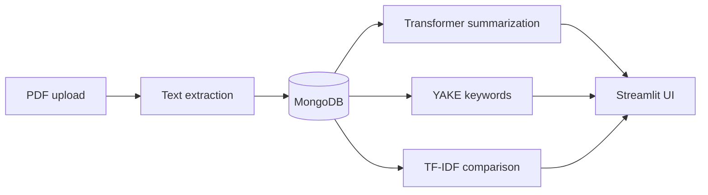

# PaperPal

[](https://github.com/zakilbaki/paperpal-rag-assistant/actions/workflows/ci.yml)

Scientific document intelligence application for uploading PDFs, generating concise
summaries, extracting keywords, and comparing papers through a web interface.

PaperPal combines a FastAPI service, Streamlit UI, MongoDB persistence, and a local
Transformer summarizer. The complete stack runs with one Docker Compose command.

> **Scope note:** the current application is document intelligence, not a complete RAG
> question-answering system. Retrieval-grounded chat is a roadmap item; the repository
> does not claim that capability before an evaluated retrieval pipeline exists.

## Product workflow



| Capability | Implementation |
| --- | --- |
| PDF ingestion | Validated upload, 1 MB limit, PyMuPDF extraction |
| Summarization | Lazy-loaded DistilBART, short/medium/detailed modes, Mongo cache |
| Keywords | YAKE extraction with configurable `top_k` |
| Comparison | Overall and section-level TF-IDF similarity, keyword overlap |
| Persistence | Async MongoDB access through one shared client |
| Delivery | FastAPI, Streamlit, MongoDB, and Docker Compose |

## Run locally

Requirements: Docker and Docker Compose. No cloud database or secret is required for
the local stack.

```bash
docker compose up --build
```

Open:

- Streamlit UI: `http://localhost:8501`
- FastAPI docs: `http://localhost:8000/docs`
- Health endpoint: `http://localhost:8000/api/v1/health/`

MongoDB data is stored in the named `mongo_data` volume. The summarization model is
downloaded on the first summary request rather than during API startup.

To use MongoDB Atlas or another model, copy the environment template and override the
defaults:

```bash
cp .env.example .env
```

Never commit the resulting `.env` file.

## API example

Upload a paper:

```bash
curl -X POST http://localhost:8000/api/v1/papers/upload \
  -F 'file=@paper.pdf'
```

Generate a summary using the returned `paper_id`:

```bash
curl -X POST http://localhost:8000/api/v1/papers/summarize \
  -H 'Content-Type: application/json' \
  -d '{
    "paper_id": "<paper_id>",
    "summary_type": "medium",
    "use_cache": true
  }'
```

## Repository structure

```text
backend/
  app/api/          FastAPI routes
  app/core/         environment settings
  app/db/           shared async Mongo connection
  app/services/     parsing, summarization, keywords
  tests/            dependency-light unit tests
frontend/
  streamlit_app.py  user interface
docker-compose.yml  local backend, frontend, and MongoDB
```

## Quality checks

The lightweight unit suite covers deterministic text chunking and scientific-section
parsing without downloading an ML model:

```bash
python -m pip install pytest pdfminer.six
PYTHONPATH=backend pytest -q backend/tests
```

GitHub Actions runs the tests and compiles all Python sources on each pull request.

## Current limitations

- The 1 MB upload limit is intentionally conservative for CPU-only hosting.
- Generated summaries still require human review; no factuality benchmark is claimed.
- Scanned PDFs require OCR, which is not included yet.
- Retrieval-grounded Q&A and retrieval evaluation are roadmap items.
- A production deployment target is intentionally out of scope; the verified target is
  the local Docker Compose stack.
